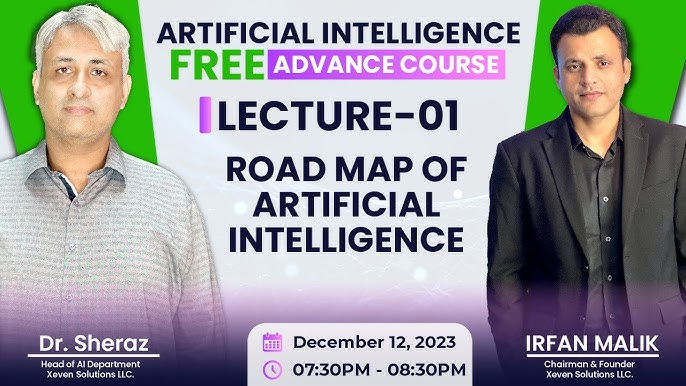

# Advance AI Course 

>**Advance AI Course by Irfan Malik** - 
In this repository, you will find: 
* Handwritten Notes: My personal handwritten notes covering key topics, concepts, and explanations from the course. 
* Slides of Lectures 
* [Youtube Playlist Link](https://youtube.com/playlist?list=PLxf3-FrL8GzRALeq_9BtdQclN6SF4bTCG&si=ZuwJ3Dq13EsaoYIM) 

----
## Topics Covered 
[Lecture Slides of Lecture 1-41]()

[1. Orientation](./1.orientation.pdf)
**Basic**
* [Lecture 1: Road map of AI](./Lect%201%20Road%20map%20of%20AI.pdf)
* [Lecture 2: MAchine Learning Essentials](./Lect%202%20Machine%20Learning%20Essentials.pdf)
* [Lecture 3: Discriminative AI vs Gen AI](/Lect%203%20Discriminative%20AI%20vs%20Gen%20AI.pdf)
* [Lecture 4: Deep Dive into Generative AI](./Lect%204%20Deep%20Dive%20Into%20Generative%20AI.pdf)
* [Lecture 5: Prompt Engineering](./Lect%205%20Prompt%20Engineering%20.pdf)
* [Lecture 6: Diffusion Models](./Lect%206%20Diffusing%20Models.pdf)
   
**Programming Concepts**  
* [Lecture 7: Programming Fundamental](./Lect%207%20Programming%20Fundamentals%20.pdf)
* [Lecture 8: Basics of Python](./Lect%208%20Basics%20of%20python%20.pdf)
* [Lecture 9: Operators](./Lect%209%20Operators%20.pdf)
* [Lecture 10: Condition & Loops in Python](./Lect%2010%20Condition%20&%20Loops%20in%20python.pdf)
[Lecture 11: Loops & Functions](./Lect%2011%20Loops%20&%20Function%20in%20python.pdf)

**API & Hugging Face**

* [Lecture 12: intro to API](./Lect%2012%20Intro%20to%20API's%20.pdf)
* [Lecture 13: Intro to Hugging Face](./Lect%2013%20Intro%20to%20Hugging%20Face.pdf)
* [Lecture 14: Hugging Face Pipeline](./Lect%2014%20Hugging%20Face%20pipelines.pdf)

**Data Science** 
* [Lecture 15: Data Science](./Lect%2015%20Data%20Science%20.pdf)
* [Lecture 16: Data Pre-processing](./Lect%2016%20Data%20Pre-Processing.pdf)

**Machine Learning**
* [Lecture 17: Classification using Scikit Learn ](./Lect%2017%20Classification%20using%20Scikit%20Learn.pdf)
* [Lecture 18: Classification Algorithms](./Lect%2018%20Classification%20Algorithms.pdf)
* [Lecture 19: Regression & its Algorithm](./Lect%2019%20Regression%20&%20it's%20algorithm%20.pdf)
* [Lecture 20: Classification Evaluation Metrics](./Lect%2020%20Classification%20Evaluation%20Metrics%20.pdf)
* [Lecture 21: Evaluation Metrics](./Lect%2021%20classification%20Evaluation%20Metrics%20.pdf)

**Deep Learning**
* [Lecture 22: Intro & Basics of Deep Learning](./Lect%2022%20intro%20&%20Basics%20of%20Deep%20Learning%20.pdf)
* [Lecture 23: Basic of Deep Learning](./Lect%2023%20Basics%20of%20Deep%20Learning%20.pdf)
* [Lecture 24: Deep Learning](./Lect%2024%20Deep%20Learning%20.pdf)
* [Lecture 25: ANN concept & Training ](./Lect%2025%20ANN%20concept%20and%20training%20.pdf)
* [Lecture 26: Training of Simple Neural Network](./Lect%2026%20Pre-req%20+%20Training%20of%20Simple%20Neural%20Network%20.pdf)
* [Lecture 27: CNN overview & working](./Lect%2027%20CNN%20overview%20and%20working%20.pdf)
* [Lecture 28: CNN in Detail ](./Lect%2028%20CNN%20in%20detail%20with%20Practical%20.pdf)
* [Lecture 29: Auto Encoders part1](./Lect%2029%20Auto-encoder%20part1.pdf)
* [Lecture 30:  Auto Encoders part2](./Lect%2030%20Auto%20Encoders.pdf)
* [Lecture 31:  Auto Encoders part3](./Lect%2031%20auto%20encoders.pdf)
* [Lecture 32: RNN ](./Lect%2032%20RNN.pdf)
* [Lecture 33: Attention Model & Transformers](./Lect%2033%20Attention%20Model%20&%20Transformers%20.pdf)
* [Lecture 34: Implementation of RNN & LSTSMS](./Lect%2034%20implementation%20of%20RNN%20&%20LSTMS.pdf)
* [Lecture 35: Transformers & GPT](./Lect%2035%20Transformers%20and%20GPT.pdf)

**RAG and Its Working**
* [Lecture 36: Intro to RAG Systems](./Lect%2036%20Intro%20to%20RAG%20System%20.pdf)
* [Lecture 37: Chunks & Embeddings ](./Lect%2037%20chunks%20&%20%20Embeddings%20.pdf)
* [Lecture 38: Embedding Models](./Lect%2038%20Embedding%20Models.pdf)
* [Lecture 39: Vector Stores](./Lect%2039%20Vector%20Stores%20.pdf)
* [Lecture 40: RAG Retrievers](./Lect%2040%20RAG%20Retrievers.pdf)

**In Summary**
>- Understanding of the fundamentals of artificial intelligence and its various applications.
> - Familiarity with popular AI tools like ChatGPT, DALL-E, and Stable Diffusion.
>- Proficiency in Python programming language and its data structures, control statements, functions, and classes.
>- Knowledge of different types of machine learning, their applications, and the difference between supervised, unsupervised, semi-supervised, and reinforcement learning.
>- Understanding of machine learning models, datasets, data preprocessing, training, testing, and evaluation metrics.
>- Familiarity with different machine learning frameworks and their usage in creating structured data models.
>- Knowledge of data visualization techniques using Matplotlib, Seaborn, and Plotly libraries.
> - Familiarity with Hugging Face library and its usage in NLP tasks like text classification, NER, and sentiment analysis.
